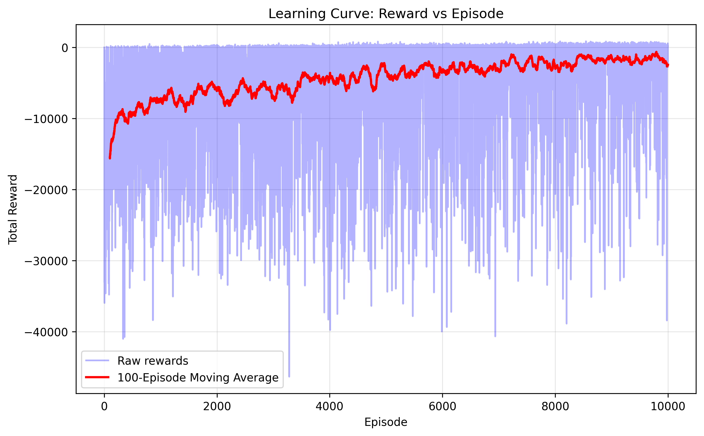

# Satellite Collision Avoidance using Reinforcement Learning

This academic project implements and evaluates reinforcement learning approaches for satellite collision avoidance in space. The project follows a structured approach to develop increasingly sophisticated reinforcement learning algorithms for a continuous state, discrete action space problem.

## Project Overview

The challenge addressed in this project is the autonomous control of a satellite to:
1. Maintain a planned orbital trajectory (y = 0)
2. Avoid collisions with space debris
3. Conserve limited fuel resources

The project is structured in three progressive tasks:

### Task 0: Markov Decision Process (MDP) Design

#### State Space
The state space is continuous and includes:
- Satellite position (pos_x, pos_y)
- Satellite velocity (vel_x, vel_y)
- Fuel remaining
- Relative positions and velocities of K debris clusters (most dangerous ones)
- Collision probabilities with each debris cluster

The observation vector is:
```
[pos_x, pos_y, vel_x, vel_y, fuel, 
 debris1_rel_x, debris1_rel_y, debris1_vel_x, debris1_vel_y, debris1_collision_prob,
 debris2_rel_x, debris2_rel_y, debris2_vel_x, debris2_vel_y, debris2_collision_prob,
 ...etc. for K debris clusters]
```

#### Action Space
The action space is discrete, with actions representing vertical acceleration commands:
```
[-5, -3, -1, 0, 1, 3, 5]
```
Each action modifies the satellite's vertical velocity (vel_y) by the specified amount. The horizontal velocity (vel_x) remains constant at 0.5.

#### Transition Dynamics
The environment implements physics-based motion with:
- Deterministic horizontal motion for the satellite
- Stochastic vertical motion with Gaussian noise proportional to vertical velocity
- Debris movement based on constant velocity
- Dynamic debris generation with increasing probability over time
- Collision detection based on probability proportional to distance

#### Reward Function
The reward function has two components:

1. **Continuous Rewards** (per time step):
   - Operational profit: `r = p0 * (1 - |pos_y| / max_deviation)`
   - Higher rewards when the satellite stays close to its planned orbit (y = 0)
   - Maximum reward (p0 = 5.0) when pos_y = 0
   - Reward decreases linearly as the satellite deviates from orbit

2. **Terminal Rewards** (at episode end):
   - Success bonus: +10 for completing maximum episode length
   - Fuel depletion penalty: -10 for running out of fuel
   - Collision penalty: -30 for colliding with debris

#### Terminal Conditions
An episode terminates when:
1. The satellite collides with debris
2. The satellite depletes its fuel
3. The maximum time steps (2000) are reached

This MDP design creates a challenging balance between maintaining the orbital path (maximizing continuous rewards) and avoiding collisions (avoiding large terminal penalties), while conserving fuel.

### Task 1: Discrete State SARSA Implementation

For Task 1, we implemented a tabular SARSA algorithm using state discretization to handle the continuous environment.

#### SARSA Algorithm
SARSA (State-Action-Reward-State-Action) is an on-policy reinforcement learning algorithm that uses the following update rule:

Q(s, a) ← Q(s, a) + α[r + γQ(s', a') - Q(s, a)]

Where:
- Q(s, a) is the value of taking action a in state s
- α is the learning rate
- r is the reward received
- γ is the discount factor
- s' is the next state
- a' is the next action chosen according to the policy

SARSA is "on-policy" because it updates using the action a' that would actually be taken by the current policy, rather than the optimal action.

#### Implementation Details
Our implementation includes:

1. **State Discretization**:
   - Selected key features: satellite position, velocity, fuel level, and relative positions of debris
   - Used non-uniform binning with higher resolution near orbit center (y = 0)
   - Applied 20 bins for position and 15 bins for velocity to prioritize orbit maintenance

2. **Exploration Strategy**:
   - Epsilon-greedy policy with initial ε = 0.6
   - Slow decay rate (0.9997) to ensure thorough exploration
   - Minimum ε = 0.1 to maintain some exploration

3. **Learning Parameters**:
   - Learning rate α = 0.03 for stable learning
   - Discount factor γ = 0.8 to focus on immediate rewards (orbit maintenance)

These choices were optimized to balance orbit maintenance with debris avoidance and fuel conservation.

#### Results
The discrete SARSA agent successfully learned a policy that:
1. Maintains orbit when possible
2. Makes evasive maneuvers when debris approaches
3. Conserves fuel for long-term operation

Learning curve showing episode rewards over time:



#### Policy Demonstration
A video demonstration of the trained agent at episode 7000 can be viewed below:

[Click here to view the satellite avoidance demonstration video](satellite_demo_episode_7000.mp4)

To include a video in your README when hosting on platforms like GitHub:
1. Save your episode 7000 video in the project directory as `satellite_demo_episode_7000.mp4`
2. For GitHub, you can use the following Markdown:
   ```markdown
   https://github.com/yourusername/satellite-collision-avoidance/assets/yourusernumber/satellite_demo_episode_7000.mp4
   ```
   (You'll need to upload the video as an issue attachment first to get a URL)

3. Alternatively, you can use an HTML video tag directly in the README:
   ```html
   <video src="satellite_demo_episode_7000.mp4" controls="controls" style="max-width: 730px;">
   </video>
   ```

### Task 2: Semi-Gradient SARSA with Function Approximation

For Task 2, we implemented a semi-gradient SARSA algorithm using linear function approximation to handle the continuous state space without discretization.

#### Implementation Details

1. **Feature Representation**:
   - Used tile coding to create features from continuous state variables
   - Applied 16 tilings with 8 tiles per dimension
   - Implemented non-uniform tiling with higher resolution near the orbit (y = 0)
   - Included both satellite state variables and debris information

2. **Linear Function Approximation**:
   - Used linear combination of features to estimate Q-values
   - Applied semi-gradient update rule for learning
   - Initialized weights with small random values

3. **Learning Parameters**:
   - Smaller learning rate (α = 0.002) appropriate for function approximation
   - Discount factor γ = 0.95
   - Exploration parameters similar to discrete SARSA

#### Challenges and Limitations

The semi-gradient SARSA implementation faced significant challenges:
- Difficult convergence behavior with excessive deviations from orbit
- Tendency to prioritize debris avoidance over orbit maintenance
- Unstable learning dynamics requiring careful hyperparameter tuning

Due to these issues, the semi-gradient approach did not achieve satisfactory performance in the given time constraints. The function approximation version tended to learn policies that would consistently deviate significantly from the orbital path, suggesting difficulties in balancing the competing objectives.

These challenges highlight the difficulties in applying function approximation to problems with multiple competing objectives and sparse rewards. Further research would be needed to address these limitations through techniques like reward shaping, prioritized experience replay, or alternative function approximation methods.

## Environment Details

The environment (`SpaceEnv` class) simulates:
- A satellite with position, velocity, and fuel state
- Multiple debris clusters with positions and velocities
- Physics-based motion and collision detection
- A reward system that balances orbital efficiency, collision avoidance, and fuel conservation

Key features:
- Dynamic debris generation with increasing probability over time
- Euclidean distance-based collision probability calculation
- Gaussian error in maneuvers to simulate uncertainty

## Visualization

The project uses the [Rerun](https://www.rerun.io/) visualization library to create interactive visualizations:
- Real-time satellite position and trajectory 
- Debris positions and movement
- Maneuver actions
- Performance metrics (reward, fuel, deviation, survival probability)

## Installation and Usage

```bash
# Clone this repository
git clone https://github.com/yourusername/satellite-collision-avoidance.git

# Navigate to project directory
cd satellite-collision-avoidance

# Install dependencies
pip install -r requirements.txt

# Run the discrete SARSA implementation
python main.py

# Run the semi-gradient SARSA implementation
python main.py agent_type="semigradient"
```

## Project Files

- `main.py`: Entry point script that initializes and runs the training
- `environment.py`: Contains the `SpaceEnv` class that implements the space environment
- `sarsa.py`: Implements the `SarsaAgent` class with the tabular SARSA algorithm (Task 1)
- `semigradient_sarsa.py`: Implements the `SemiGradientSarsaAgent` with function approximation (Task 2)
- `visualization.py`: Contains the `RerunLogger` class for visualization
- `rerun_logs/`: Directory containing saved visualization logs and learning curves

## Future Research Directions

- Implement Deep Q-Networks (DQN) for more effective function approximation
- Explore actor-critic methods like DDPG for continuous action spaces
- Investigate reward shaping techniques to better balance competing objectives
- Apply Prioritized Experience Replay to learn more effectively from important experiences
- Develop multi-agent approaches for collaborative collision avoidance

## Academic Context

This project demonstrates the application of reinforcement learning to a realistic space operations problem with continuous state space and multiple competing objectives. The progression from MDP design to discrete methods and finally to function approximation follows educational reinforcement learning curriculum design.

The implementation illustrates several key RL concepts:
- The impact of state representation and discretization
- The balance between exploration and exploitation
- The challenges of credit assignment with delayed rewards
- The tradeoffs between tabular methods and function approximation

## Acknowledgments

- This project is inspired by real-world satellite collision avoidance challenges
- Visualization powered by [Rerun](https://www.rerun.io/)